```{r setup, include=FALSE}
options(htmltools.dir.version = FALSE)
knitr::opts_chunk$set(warning = FALSE, message = FALSE, 
                      fig.retina = 3, fig.align = "center")
```

```{r xaringanExtra, echo=FALSE}
xaringanExtra::use_xaringan_extra(c("tile_view"))
xaringanExtra::use_share_again()
```


class: center middle main-title section-title-2

# La reforma de los procesos laborales<br>en América Latina

.class-info[

.medium[**Paul Paredes**]

**TSS603 Procesos laborales**

.light.small[Maestría en Derecho del Trabajo y de la Seguridad Social<br>
Pontificia Universidad Católica del Perú<br>
29 de marzo, 2021]

]

---

name: outline
class: title title-inv-2

# Plan de la clase

--

.box-2.small[Presentación]

--

.box-2.small[La (necesidad) reforma de los procesos laborales en América Latina]

--

.box-2.small[Los ejes de la reforma procesal en Perú (2008)]

--

.box-2.small[Actividades realizadas, necesarias y beneficios esperados]

--

.box-2.small[La tendencia en América Latina]

--

.box-3.small[Principios y fundamentos del proceso laboral]

---

layout: false
name: reforma-procesal-laboral
class: center middle section-title section-title-2 animated fadeIn

# La reforma del proceso laboral

---

layout: true
class: title title-2

---

# ¿Necesidad de la reforma?

.box-inv-2.medium[Proceso breve y sencillo]

.box-inv-2.medium[Acceso a la justicia]

.box-inv-2.medium[Medidas de protección]

---

# Los ejes (oficiales) de la reforma

.box-inv-2.medium[R.M. 044-2008-TR (febrero de 2008)]

.center[

]

???

background-image: url(https://raw.githubusercontent.com/PaulParedes/materiales/master/rm044-2008-tr.png)
background-size: auto
background-position: center

---

# Los ejes (oficiales) de la reforma

&nbsp;

.box-inv-2.medium[La oralidad]

&nbsp;

.box-inv-2.medium[Uso intensivo de la tecnología]

---

# Actividades realizadas

.pull-left[

.box-inv-2.medium[Plantear como pilares la oralidad y el uso intensivo de la tecnología (¿y el acceso a la justicia?)]

.box-inv-2.medium[Comisión de redacción]
]

.pull-right[

.box-inv-2.medium[Conociendo otros OOJJ (viajes, códigos)]

.box-inv-2.medium[Comisión de revisión]

.box-inv-2.medium[Foros de discusión]
]

---

# Actividades (necesarias)

.box-inv-2.medium[Formación y capacitación]

.box-inv-2.small[Implementación material de los despachos. Infraestructura]

.box-inv-2.medium[La NLPT]

.box-inv-2.small[Seguimiento y retroalimentación del nuevo proceso]

---

# Beneficios esperables (¿?) de la reforma

.pull-left[
.box-inv-2.small[Celeridad: 6 meses]

.box-inv-2.small[Ensanchamiento de la base poblacional con acceso a la justicia laboral]

.box-inv-2.small[Simplicidad del procedimiento]
]

.pull-right[
.box-inv-2.small[Predictibilidad de la justicia laboral]

.box-inv-2.small[Modernidad de los procedimientos]

.box-inv-2.small[Revaloración del rol de la Corte Suprema]
]
---

# La reforma en América Latina


.pull-left[

.box-2.medium[Perspectiva estática]

.box-inv-2.medium[Legislativa]

.box-inv-2.medium[¿Cómo es el proceso laboral?]

]

.pull-right[

.box-2.medium[Perspectiva dinámica]

.box-inv-2.medium[El proceso en acción]

.box-inv-2.medium[¿Cómo viene funcionando el proceso laboral?]
]

---

# La experiencia ecuatoriana 

.box-inv-2.medium[Oralidad, inmediación, concentración]

.box-inv-2.medium[Grabación magnetofónica]

.box-inv-2.medium[Trascripción en acta]

---

# La experiencia venezolana

.box-inv-2.small[Infraestructura]

.box-inv-2.small[Capacitación]

.box-inv-2.small[Efectividad de la conciliación (85%)]

.box-inv-2.small[Oralidad, inmediación, concentración]

.box-inv-2.small[Grabación audiovisual]

.box-inv-2.small[Sentencia al final de la audiencia de juicio]

.box-inv-2.small[Lentitud en la etapa de casación]

---

# La reforma en América Latina

.pull-left[
.box-inv-1.small[Venezuela, agosto 2003]

.box-inv-2.small[Ecuador, julio 2004]

.box-inv-3.small[Colombia, enero 2008]

.box-inv-4.small[Chile, marzo 2008]

.box-inv-5.small[Bolivia, (1979), 2009]
]

.pull-right[

.box-inv-5.small[Uruguay, febrero 2010]

.box-inv-4.small[Perú, enero-julio 2010]

.box-inv-3.small[Costa Rica, 2012]

.box-inv-2.small[Nicaragua, 2012]

.box-inv-1.small[México, 2019 (2022)]
]

---

# La tendencia actual a la oralidad

.box-inv-2.small[Mayor dosis de oralidad (que no excluye la escritura, sino que acerca, concentra y simplifica)]

.box-inv-2.small[Uso de nuevas tecnologías]

.box-inv-2.small[Rol protagónico del juez]

.box-inv-2.small[Fortalecimiento de los mecanismos alternativos de solución de conflictos]

.box-inv-2.small[Protección especial frente a la vulneración de derechos fundamentales]

---

# La tendencia actual a la oralidad

.box-inv-2.medium[Principio protector]

.box-inv-2.small[Igualdad por compensación]

.box-inv-2.small[Fondo vs. Forma]

.box-inv-2.small[A favor del proceso]

.box-inv-2.small[Simplicidad]

.box-inv-2.small[Acceso a la justicia]

.box-inv-2.small[Debido proceso/tutela judicial]

---
class: animated, fadeIn

# La tendencia actual a la oralidad

.box-inv-2.medium[Principio protector]

.box-inv-2.small[Ampliación de las medidas cautelares y celeridad en la ejecución de la sentencia]

.box-inv-2.small[Igualdad en la aplicación de la ley]

.box-inv-2.small[Predictibilidad de las resoluciones]

.box-inv-2.small[Eficacia de la justicia]

.box-inv-2.small[Una justicia pronta]

.box-inv-2.small[La teoría del caso*]

---

layout: false
name: oralidad-tecnologia
class: center middle section-title section-title-3 animated fadeIn

# Oralidad y tecnología

---

layout: true
class: title title-3

---

# La oralidad

&nbsp;


.box-inv-3.large[«hay que **diseñar** un procedimiento laboral que sea oral»]

---

# ... pero

&nbsp;

.box-inv-3.large[¿La Ley 26636 regula, incorpora, describe un proceso *escrito*?]

---

# Mauro Cappelletti

.box-inv-3.medium[«El moderno **‘sistema de la oralidad’** [es aquel] en el cual las partes, los defensores y los testigos **hablan**, más que escriben, **al juez** en la **audiencia** pública, y en el cual, por tanto, la audiencia viene a constituir el momento más importante del proceso.»]

---

# Proceso oral

.box-inv-3.medium[Proceso que reúne, en la audiencia, a las partes, sus abogados, el material probatorio y el juez, para conocer y resolver una causa.]

---

# Artículo I, Título Preliminar, Ley 26636

.box-inv-3.medium[«Las audiencias y actuación de los medios probatorios se realizan ante el juez, siendo indelegables bajo sanción de nulidad».]

---

.box-inv-3.medium[«No basta cambiar la ley para tener procesos orales»]

---

# Uso intensivo de la tecnología

.box-inv-3.normal[Notificaciones electrónicas, a cargo del PJ]

.box-inv-3.normal[Expediente electrónico, a cargo del PJ]

.box-inv-3.normal[Base de datos de jurisprudencia y precedentes sistematizada, a cargo del MTPE, con la colaboración del PJ y TC]

.box-inv-3.normal[Sistema de cálculo de derechos laborales, a cargo del MTPE con la colaboración del PJ]

.box-inv-3.normal[Sistema de remisión electrónico de información de las planillas electrónicas, a cargo del MTPE]

---

layout: false
name: principios-fundamentos
class: center middle section-title section-title-4 animated fadeIn

# Principios y fundamentos del proceso laboral

---

layout: true
class: title title-4

---

# El Código Civil francés de 1804

.box-4.normal["1781. Le maître est cru sur son affirmation, Pour la quotité des gages; Pour le paiement du salaire de l'année échue; Et pour les à-comptes donnés pour l'année courante."]

.box-inv.4.normal["Al patrón se le cree por su dicho, en cuanto al monto de los salarios; en cuanto al pago del salario del año vencido; y en cuanto a lo que diga haber dado a cuenta por el año corriente".]

---

# ¿Por qué (debe haber) un proceso laboral?

--

.box-inv-4.normal[Porque hay situaciones de desigualdad sobre las cuales se hace necesario llamar la atención para gozar (acceder) efectivamente a los derechos que un ordenamiento ofrece.]

---

# Couture (1979)

.box-inv-4.medium[Un nuevo Derecho procesal, extraño a todos los principios tradicionales, sin exceptuar uno solo de ellos, ha debido surgir para establecer, mediante una nueva desigualdad, la igualdad perdida por la distinta condición que tienen en el orden económico de la vida, los que ponen su trabajo como sustancia del contrato, y los que se sirven de él para la satisfacción de sus intereses.]

---

# Proceso laboral

.box-inv-4.medium[Desigualdad como fundamento del proceso laboral (dos perspectivas)]

.pull-left[
.box-inv-4.normal[La desigualdad material y la igualdad por compensación]
]

.pull-right[
.box-inv-4.normal[La igualdad en el principio dispositivo, pero donde se reconoce que las partes no son soberanas ni iguales.]
]

---

# Proceso laboral. Dos modelos

.pull-left[
.box-inv-4.medium[De la igualdad (formal) de las partes y el juez director.]
]

.pull-right[
.box-inv-4.medium[A la igualdad efectiva de las partes (a través de la ley) y el juez director del proceso.]
]

---

# Proceso (laboral) y prueba. Dos modelos

.pull-left[
.box-inv-4.medium[Del proceso como mecanismo de resolución de conflictos, dependiente de la habilidad del abogado alejado de la verdad.]
]

.pull-right[
.box-inv-4.medium[Al proceso como solución de conflictos aplicando Derecho a los hechos ocurridos en la realidad.]
]

---

# La oralidad

.box-inv-4.medium[La oralidad como negación de la justicia de la igualdad formal:]

.pull-left[
.box-4.normal[Oralidad]
.box-4.normal[Inmediación]
.box-4.normal[Concentración]
.box-4.normal[Publicidad]
.box-4.normal[Economía]
.box-4.normal[Celeridad]
.box-4.normal[Escritura]
]

.pull-right[
.box-inv-4.normal[No inmediación]
.box-inv-4.normal[No concentración]
.box-inv-4.normal[No publicidad]
.box-inv-4.normal[No economía]
.box-inv-4.normal[No celeridad]
]

---

# La oralidad

&nbsp;

--

.box-inv-4.medium[Es el símbolo contra la justicia del juez convidado de piedra.]

--

&nbsp;

.box-inv-4.medium[La oralidad no es "técnicas que litigación oral".]

???

¿Por qué (debe haber) un proceso laboral?

Poder. Estado social. 
  + Intervención en la economía para asegurar ciertos derechos básicos

Justicia
  + Justicia distributiva
  
  + Justicia correctiva (conmutativa)

Igualdad (en la distribución)
  + De características
  + De trato (a los iguales, misma categoría)
    + a c/u lo mismo
    + a c/u lo de la ley
    + a c/u según su rango
    + a c/u según su mérito
    + a c/u según su trabajo
    + a c/u según su necesidad

Igualdad (¿cómo distribuir?)
  + En el proceso de distribución igualitario
  + En el resultado igualitario
  
Tres nociones de igualdad en las constituciones

1. Igualdad política
  + Reparto del poder político en una sociedad
  + Participación en la producción de las normas jurídicas

2. Igualdad ante la ley
  + Normas generales y no arbitrarias: casos iguales, se resuelven iguales
  + Prohibición de discriminar: (no siempre hay que tratar igual a todos en ciertas circunstancias, pero nunca se puede utilizar ciertas características para diferenciar el trato)

3. Igualdad en la ley (a través de la ley)
  + La aplicación del Derecho debe producir resultados igualitarios en cuanto a las condiciones de vida de los ciudadanos
  + Podría parecer ir contra la igualdad ante la ley en abstracto (acción afirmativa)

Couture

**Couture** planteó que la razón de ser del Derecho procesal del trabajo era asegurar ciertos resultados mínimos de justicia dentro de la desigual relación del trabajo, y que para lograrlo era necesario establecer la igualdad mediante una desigualdad: la igualdad por compensación.

Pregunta:
¿Qué noción de igualdad daría respaldo a la postura de Couture?

Impacto de la desigualdad (económica y social)

+ En la configuración de las relaciones laborales

+ En el valor epistémico de la prueba

+ En valores de política pública (p. ej. la justicia distributiva)

La desigualdad como fundamento del proceso laboral (dos perspectivas)

1. La desigualdad material y la igualdad por compensación

2. La igualdad en el principio dispositivo

PRINCIPIO DISPOSITIVO

2. La igualdad en el principio dispositivo

1. El principio dispositivo (según lo alegado y probado) prohíbe apreciar, de oficio, hechos relevantes que constan en el proceso pero que no han sido propuestos expresamente por las partes.

2. De vincular al juez a lo alegado y probado no se sigue, necesariamente, que la actuación del juez esté completamente sometida a las partes.

Principio dispositivo

+ Afirmar la sujeción del juez a la soberanía de las partes camufla una idea de desigualdad: si las partes son soberanas, entonces, son igualmente soberanas.

+ ¿Son las partes iguales?

+ Si todo se deja al principio dispositivo (en su versión más restrictiva), entonces se niega el derecho de defensa de una de las partes.

+ Se trata de afirmar el p. dispositivo pero sin llevar a convertir al proceso en "una cosa de las partes"

+ Presencia de algunas notas del p. inquisitivo en clave de optimización de la decisión. 

+ Pero también en clave de optimización epistémica (evitar que se cree una realidad paralela y el sistema procesal no tendría nada que decir)

---

# La igualdad por compensación

.box-inv-4.medium[La igualdad por compensación: el procedimiento lógico de corregir las desigualdades es el crear otras desigualdades]

.box.inv-4.normal[El principio de imparcialidad: igualdad de armas]

.box.inv-4.normal[Quien produce y conserva un medio de prueba | Sin acceso al medio de prueba]

.box.inv-4.normal[Quien dispone cómo ejecutar un servicio y cómo se deja constancia de ello | Quien está sometido a las órdenes]

.box.inv-4.normal[La igualdad de armas es un objetivo por cumplir]

.box.inv-4.normal[Importancia de los poderes del juez]

---

# La igualdad por compensación

.box-inv-4.large[La igualdad por compensación se posiciona como el fundamento de las actuaciones procesales en los conflictos laborales.]

---

# Tres datos 

## Tres datos como respaldo epistémico a la desigualdads de las relaciones jurídicas laborales en el Perú

.box-inv-4.normal[Informalidad laboral: en 2015, 55.5%; en microempresas, 88.7%]

.box-inv-4.normal[Contratos a plazo fijo: 78% fijos vs. 22% indeterminado]

.box-inv-4.normal[Sindicación y cobertura de la negociación colectiva: 6% y 5.1%, respectivamente.]

---

# Mario Pasco. Fundamentos de DPT

## Principios del derecho procesal del trabajo 

### A. VERACIDAD 
1. Limitación al formalismo (prevalencia fondo sobre forma)
  + simplicidad 
  + prohibición de pruebas (juramento decisorio)
  + relativización de ciertas pruebas (declaración de parte, confesión, instrumentos)
  + libertad probatoria 

---

# Mario Pasco. Fundamentos de DPT

## Principios del derecho procesal del trabajo 

2.Ampliación facultades juez
  + inhibición de oficio 
  + suplencia demanda 
  + impulso procesal 
  + sentencia inmediata 

3.Facultad ultra y extra petita 

---

# Mario Pasco. Fundamentos de DPT

## Principios del derecho procesal del trabajo 

### B. PRINCIPIO PROTECTOR 

1. Reglas pro operario 
  + Retroactividad 
  + In dubio pro operario 
  + Norma más favorable 
  + Condición más beneficiosa 

2. Iniciativa de oficio del proceso 

---

# Mario Pasco. Fundamentos de DPT

## Principios del derecho procesal del trabajo

3. Redistribución de la carga de la prueba 

4. Otras normas de protección 
  + Gratuidad 
  + Defensa gratuita 
  + Oralidad, concentración, inmediación, celebridad 

5. Ponderación ecuánime del principio protector 

---

# Mario Pasco. Fundamentos de DPT

## Principios del derecho procesal del trabajo 

### C. CRITERIO DE CONCIENCIA Y EQUIDAD 
1. Criterio de conciencia en la evaluación de las pruebas 
2. Equidad 

### Tres funciones de los principios 
1. Informadora. Inspira al legislador. 
2. Normativa. Fuente supletoria. 
3. Interpretadora. 

---
class: animated, fadeIn

# NLPT

> **Artículo I.- Principios del proceso laboral**

> El proceso laboral se inspira, entre otros, en los principios de inmediación, oralidad, concentración, celeridad, economía procesal y veracidad.
	
---
class: animated, fadeIn

# NLPT

> **Artículo II.- Ámbito de la justicia laboral**
> Corresponde a la justicia laboral resolver los conflictos jurídicos que se originan con ocasión de las prestaciones de servicios de carácter personal, de naturaleza laboral, formativa, cooperativista o administrativa; están excluidas las prestaciones de servicios de carácter civil, salvo que la demanda se sustente en el encubrimiento de relaciones de trabajo. Tales conflictos jurídicos pueden ser individuales, plurales o colectivos, y estar referidos a aspectos sustanciales o conexos, incluso previos o posteriores a la prestación efectiva de los servicios.

---
class: animated, fadeIn

# NLPT 

>**Artículo III.- Fundamentos del proceso laboral**

>En todo proceso laboral los jueces deben evitar que la desigualdad entre las partes afecte el desarrollo o resultado del proceso, para cuyo efecto procuran alcanzar la igualdad real de las partes, privilegian el fondo sobre la forma, interpretan los requisitos y presupuestos procesales en sentido favorable a la continuidad del proceso, observan el debido proceso, la tutela jurisdiccional y el principio de razonabilidad. En particular, acentúan estos deberes frente a la madre gestante, el menor de edad y la persona con discapacidad.

---

# NLPT

> Los jueces laborales tienen un rol protagónico en el desarrollo e impulso del proceso. Impiden y sancionan la inconducta contraria a los deberes de veracidad, probidad, lealtad y buena fe de las partes, sus representantes, sus abogados y terceros.

> El proceso laboral es gratuito para el prestador de servicios, en todas las instancias, cuando el monto total de las pretensiones reclamadas no supere las setenta (70) Unidades de Referencia Procesal (URP).

---
class: animated, fadeIn

# NLPT

> **Artículo IV.- Interpretación y aplicación de las normas en la resolución de los conflictos de la justicia laboral**

> Los jueces laborales, bajo responsabilidad, imparten justicia con arreglo a la Constitución Política del Perú, los tratados internacionales de derechos humanos y la ley. Interpretan y aplican toda norma jurídica, incluyendo los convenios colectivos, según los principios y preceptos constitucionales, así como los precedentes vinculantes del Tribunal Constitucional y de la Corte Suprema de Justicia de la República.

---
class: animated, fadeIn

# En otros países

+ Oralidad
+ Gratuidad
+ Prueba de oficio
+ Ultra petita 
+ Extra petita (Colombia, Venezuela)

---
class: inverse, middle, center, animated, BounceInDown

# ¿Cómo surge el proceso laboral?

--

# Dos valores imprescindibles en cualquier proceso

--
.center[
##  + Imparcialidad
]

--
.center[
##  + Derecho de defensa
]

---
class: animated, slideInRight

.left-column[
# Pregunta:
]
.right-column[
### ¿Qué tipo de proceso (oral o escrito) permite una imparcialidad "más" intensa?

### ¿Qué tipo de juez (espectador o director) permite un derecho de defensa "más" fuerte? 
]

---
class: animated, fadeIn

# Modelo 1

# Imparcialidad --> derecho de defensa

### 1. Equidistancia (no contacto con las partes)

### 2. Sometido a las partes

## + --> juez espectador

## + --> proceso escrito, principio dispositivo 

---
class: animated, inverse, slideInRight

# Código Civil francés de 1804

> ## “1781. Le maître est cru sur son affirmation, Pour la quotité des gages; Pour le paiement du salaire de l'année échue; Et pour les à-comptes donnés pour l'année courante.” 

> ## “Al patrón se le cree por su dicho, en cuanto al monto  de los salarios; en cuanto al pago del salario del año vencido; y en cuanto a lo que diga haber dado a cuenta para el año en curso.”

---
class: animated, fadeIn

# Modelo 2

# Imparcialidad --> derecho de defensa

### 1. Sometimiento al Derecho (puede haber contacto con las partes)

### 2. Sometido a las partes, pero con facultades de oficio

## + --> juez director

## + --> proceso oral, principio dispositivo atenuado (con notas del p. inquisitivo)

---
class: animated, fadeIn, center, middle

# Proceso oral vs. proceso escrito 

.pull-left[
- Inmediación

- Concentración

- Publicidad

- Celeridad

- Economía procesal

- Veracidad (mayor)

- Informalismo
]

.pull-right[
- No inmediación

- No concentración

- Publicidad (menor)

- No celeridad

- No economía procesal

- Veracidad (menor)

- Formalismo
]

---
class: animated, inverse, center, middle, bounceInDown

# Las pretensiones en la justicia laboral

---
class: animated, fadeIn

# ¿Qué abarca la justicia laboral?

## Ámbito

### Criterios:

+ Materia*

+ Tipo de relación 

+ Lugar geográfico

+ Órgano jurisdiccional 

---
class: animated, fadeIn

# ¿Qué pretensiones se pueden proponer en el justicia laboral?

--

### Respuesta 1: (materia*)

> Las pretensiones que están listadas en el artículo 2 de la NLPT, sin ser exclusivas.

Las pretensiones relacionadas a los siguientes aspectos, temas:

a) El nacimiento, desarrollo y extinción de la prestación personal de servicios; así como a los correspondientes actos jurídicos.

b) La responsabilidad por daño patrimonial o extrapatrimonial, incurrida por cualquiera de las partes involucradas en la prestación personal de servicios, o terceros en cuyo favor se presta o prestó el servicio.

c) Los actos de discriminación en el acceso, ejecución y extinción de la relación laboral.

d) El cese de los actos de hostilidad del empleador, incluidos los actos de acoso moral y hostigamiento sexual, conforme a la ley de la materia.

---
# ...

e) Las enfermedades profesionales y los accidentes de trabajo.

f) La impugnación de los reglamentos internos de trabajo.

g) Los conflictos vinculados a una organización sindical y entre organizaciones sindicales, incluida su disolución.

h) El cumplimiento de obligaciones generadas o contraídas con ocasión de la prestación personal de servicios exigibles a institutos, fondos, cajas u otros.

i) El cumplimiento de las prestaciones de salud y pensiones de invalidez, a favor de los asegurados o los beneficiarios, exigibles al empleador, a las entidades prestadoras de salud o a las aseguradoras.

j) El Sistema Privado de Pensiones.

k) La nulidad de cosa juzgada fraudulenta laboral.

l) **(OTROS)**

---
class: animated, fadeIn

# Ámbito de la justicia laboral

> Se aplica a TODO conflicto jurídico derivado de una prestación personal de servicios remunerada:

--

<style type="text/css">
.tg  {border-collapse:collapse;border-spacing:0;}
.tg td{border-color:black;border-style:solid;border-width:1px;font-family:Arial, sans-serif;font-size:14px;
  overflow:hidden;padding:10px 5px;word-break:normal;}
.tg th{border-color:black;border-style:solid;border-width:1px;font-family:Arial, sans-serif;font-size:14px;
  font-weight:normal;overflow:hidden;padding:10px 5px;word-break:normal;}
.tg .tg-gure{background-color:#9aff99;border-color:inherit;font-family:Georgia, serif !important;;font-size:20px;text-align:left;
  vertical-align:top}
.tg .tg-yd3j{border-color:inherit;font-family:Georgia, serif !important;;font-size:20px;text-align:left;vertical-align:top}
</style>
<table class="tg">
<thead>
  <tr>
    <th class="tg-gure">De naturaleza</th>
    <th class="tg-gure">Sobre derechos</th>
    <th class="tg-gure">Respecto de temas</th>
    <th class="tg-gure">Ocurridos</th>
  </tr>
</thead>
<tbody>
  <tr>
    <td class="tg-yd3j"><span style="color:#000">Laboral</span><br><br><span style="color:#000">Formativa</span><br><br><span style="color:#000">Cooperativista</span><br><br><span style="color:#000">Administrativa</span></td>
    <td class="tg-yd3j"><span style="color:#000">Individuales</span><br><br><span style="color:#000">Plurales</span><br><br><span style="color:#000">Colectivos</span></td>
    <td class="tg-yd3j"><span style="color:#000">Sustanciales</span><br><br><span style="color:#000">Conexos</span></td>
    <td class="tg-yd3j"><span style="color:#000">Antes</span><br><br><span style="color:#000">Durante</span><br><br><span style="color:#000">Después</span></td>
  </tr>
</tbody>
</table>

---
class: animated, fadeIn

### Respuesta 2: (tipo de relación)

> Todas las pretensiones relativas a cualquiera de los 4 tipos de relaciones considerados: laboral, formativa, cooperativista y administrativa.

---
class: animated, fadeIn

### Lugar geográfico (competencia por territorio)

<style type="text/css">
.tg  {border-collapse:collapse;border-spacing:0;}
.tg td{border-color:black;border-style:solid;border-width:1px;font-family:Arial, sans-serif;font-size:14px;
  overflow:hidden;padding:10px 5px;word-break:normal;}
.tg th{border-color:black;border-style:solid;border-width:1px;font-family:Arial, sans-serif;font-size:14px;
  font-weight:normal;overflow:hidden;padding:10px 5px;word-break:normal;}
.tg .tg-6c8b{font-family:Georgia, serif !important;;font-size:20px;text-align:left;vertical-align:top}
.tg .tg-a9uw{background-color:#9aff99;font-family:Georgia, serif !important;;font-size:20px;text-align:left;vertical-align:top}
</style>
<table class="tg">
<thead>
  <tr>
    <th class="tg-a9uw"><span style="font-weight:bold;color:#000">Regla, a elección del demandante</span></th>
    <th class="tg-a9uw"><span style="font-weight:bold;color:#000">Si la demanda es dirigida contra quien prestó los servicios</span></th>
    <th class="tg-a9uw"><span style="font-weight:bold;color:#000">En el caso de  impugnación de laudos arbitrales económicos</span></th>
  </tr>
</thead>
<tbody>
  <tr>
    <td class="tg-6c8b"><span style="color:#000">El juez del lugar del domicilio principal del demandado, o,</span><br><br><span style="color:#000">El juez del último lugar donde se prestaron los servicios</span></td>
    <td class="tg-6c8b"><span style="color:#000">Solo es competente el juez del domicilio del prestador de servicios</span></td>
    <td class="tg-6c8b"><span style="color:#000">Solo es competente la sala laboral del lugar donde se expidió el laudo</span></td>
  </tr>
</tbody>
</table>

--

<br/>

***

+ La competencia por razón de territorio solo puede ser prorrogada cuando resulte a favor del prestador de servicios.

+ NLPT: Falta: Huancavelica, Cerro de Pasco, Apurímac, Huaura, Madre de Dios, Amazonas, San Martín
+ Previsto: 
    + Apurímac: 01.12.2020
    + Pasco: 10.12.2020
    + Huaura: 11.12.2020

---
class: animated, fadeIn

### Órgano jurisdiccional 

### Juzgados especializados de trabajo

<style type="text/css">
.tg  {border-collapse:collapse;border-spacing:0;}
.tg td{border-color:black;border-style:solid;border-width:1px;font-family:Arial, sans-serif;font-size:14px;
  overflow:hidden;padding:10px 5px;word-break:normal;}
.tg th{border-color:black;border-style:solid;border-width:1px;font-family:Arial, sans-serif;font-size:14px;
  font-weight:normal;overflow:hidden;padding:10px 5px;word-break:normal;}
.tg .tg-6c8b{font-family:Georgia, serif !important;;font-size:20px;text-align:left;vertical-align:top}
.tg .tg-a9uw{background-color:#9aff99;font-family:Georgia, serif !important;;font-size:20px;text-align:left;vertical-align:top}
</style>
<table class="tg">
<thead>
  <tr>
    <th class="tg-a9uw"><span style="font-weight:bold;color:#000">En proceso ordinario laboral</span></th>
    <th class="tg-a9uw"><span style="font-weight:bold;color:#000">En proceso abreviado laboral</span></th>
    <th class="tg-a9uw"><span style="font-weight:bold;color:#000">En proceso contencioso administrativo</span></th>
    <th class="tg-a9uw"><span style="font-weight:bold;color:#000">En proceso de ejecución</span></th>
  </tr>
</thead>
<tbody>
  <tr>
    <td class="tg-6c8b"><span style="color:#000">Todo conflicto jurídico de naturaleza laboral, formativa o cooperativista, </span><span style="font-weight:bold;color:#000">mayor 50 URP o sin expresión monetaria</span><br><br><span style="color:#000">El listado de materias es meramente ilustrativo</span></td>
    <td class="tg-6c8b"><span style="color:#000">Reposición, cuando se plantea como pretensión principal única</span><br><br><span style="color:#000">Pretensiones relativas a la vulneración de la libertad sindical</span></td>
    <td class="tg-6c8b"><span style="color:#000">Todo conflicto jurídico de naturaleza laboral, administrativa o de seguridad social, de derecho público</span><br><br><span style="color:#000">Impugnación de actuaciones de la AAT</span></td>
    <td class="tg-6c8b"><span style="color:#000">Títulos ejecutivos mayor a 50 URP</span></td>
  </tr>
</tbody>
</table>

---
class: animated, fadeIn

### Órgano jurisdiccional 

### Juzgados de paz letrados laborales

<style type="text/css">
.tg  {border-collapse:collapse;border-spacing:0;}
.tg td{border-color:black;border-style:solid;border-width:1px;font-family:Arial, sans-serif;font-size:14px;
  overflow:hidden;padding:10px 5px;word-break:normal;}
.tg th{border-color:black;border-style:solid;border-width:1px;font-family:Arial, sans-serif;font-size:14px;
  font-weight:normal;overflow:hidden;padding:10px 5px;word-break:normal;}
.tg .tg-e904{font-family:Georgia, serif !important;;font-size:20px;text-align:left;vertical-align:top}
.tg .tg-jtsx{background-color:#9aff99;font-family:Georgia, serif !important;;font-size:20px;text-align:left;vertical-align:top}
</style>
<table class="tg">
<thead>
  <tr>
    <th class="tg-jtsx"><span style="font-weight:bold;color:#000">En proceso abreviado laboral</span></th>
    <th class="tg-jtsx"><span style="font-weight:bold;color:#000">En proceso de ejecución</span></th>
    <th class="tg-jtsx"><span style="font-weight:bold;color:#000">Procesos no contenciosos</span></th>
  </tr>
</thead>
<tbody>
  <tr>
    <td class="tg-e904"><span style="color:#000">Las pretensiones:</span><br><br><span style="color:#000">. atribuidas originalmente a los Juzgados de Trabajo,</span><br><br><span style="color:#000">1. que sean obligaciones de dar, </span><span style="text-decoration:underline;color:#000">y</span><br><br><span style="color:#000">2. hasta 50 URP</span></td>
    <td class="tg-e904"><span style="color:#000">Títulos ejecutivos hasta 50 URP</span><br><br><span style="color:#000">Cobranza de aportes previsionales del sistema privado de pensiones retenidos por el empleador, sin importar la cuantía</span></td>
    <td class="tg-e904"><span style="color:#000">Todos los asuntos no contenciosos, sin importar la cuantía</span></td>
  </tr>
</tbody>
</table>

---
class: animated, fadeIn

### Órgano jurisdiccional

### Salas laborales superiores

<style type="text/css">
.tg  {border-collapse:collapse;border-spacing:0;}
.tg td{border-color:black;border-style:solid;border-width:1px;font-family:Arial, sans-serif;font-size:14px;
  overflow:hidden;padding:10px 5px;word-break:normal;}
.tg th{border-color:black;border-style:solid;border-width:1px;font-family:Arial, sans-serif;font-size:14px;
  font-weight:normal;overflow:hidden;padding:10px 5px;word-break:normal;}
.tg .tg-6c8b{font-family:Georgia, serif !important;;font-size:20px;text-align:left;vertical-align:top}
.tg .tg-a9uw{background-color:#9aff99;font-family:Georgia, serif !important;;font-size:20px;text-align:left;vertical-align:top}
</style>
<table class="tg">
<thead>
  <tr>
    <th class="tg-a9uw"><span style="font-weight:bold;color:#000">En proceso de acción popular</span></th>
    <th class="tg-a9uw"><span style="font-weight:bold;color:#000">En proceso de anulación de laudo arbitral jurídico</span></th>
    <th class="tg-a9uw"><span style="font-weight:bold;color:#000">En proceso impugnativo de laudos arbitrales económicos</span></th>
  </tr>
</thead>
<tbody>
  <tr>
    <td class="tg-6c8b"><span style="color:#000">La acción popular en materia laboral, conforme a las reglas del Código Procesal Constitucional</span></td>
    <td class="tg-6c8b"><span style="color:#000">La anulación de laudo que resuelve un conflicto jurídico de naturaleza laboral, conforme a las reglas de la Ley de Arbitraje</span></td>
    <td class="tg-6c8b"><span style="color:#000">Impugnación de laudos arbitrales derivados de una negociación colectiva</span></td>
  </tr>
</tbody>
</table>

---
class: animated, slideInRight, center, inverse, middle

# En otros países

---
class: animated, fadeIn

# Límites menor cuantía

<style type="text/css">
.tg  {border-collapse:collapse;border-spacing:0;}
.tg td{border-color:black;border-style:solid;border-width:1px;font-family:Arial, sans-serif;font-size:14px;
  overflow:hidden;padding:10px 5px;word-break:normal;}
.tg th{border-color:black;border-style:solid;border-width:1px;font-family:Arial, sans-serif;font-size:14px;
  font-weight:normal;overflow:hidden;padding:10px 5px;word-break:normal;}
.tg .tg-67cq{border-color:inherit;font-family:Georgia, serif !important;;font-size:20px;text-align:left;vertical-align:top}
.tg .tg-76gi{background-color:#9aff99;border-color:inherit;font-family:Georgia, serif !important;;font-size:20px;font-weight:bold;
  text-align:left;vertical-align:top}
.tg .tg-jztj{border-color:inherit;font-family:Georgia, serif !important;;font-size:20px;font-weight:bold;text-align:left;
  vertical-align:top}
.tg .tg-ebfe{border-color:inherit;font-family:Georgia, serif !important;;font-size:20px;text-align:left;vertical-align:middle}
</style>
<table class="tg">
<thead>
  <tr>
    <th class="tg-76gi">País</th>
    <th class="tg-76gi">Criterio</th>
    <th class="tg-76gi">Monto MN</th>
    <th class="tg-76gi">Monto Soles</th>
    <th class="tg-76gi">Tratamiento</th>
  </tr>
</thead>
<tbody>
  <tr>
    <td class="tg-jztj">Perú</td>
    <td class="tg-67cq">50 URP</td>
    <td class="tg-67cq">PEN 21,500</td>
    <td class="tg-67cq">S/21,500</td>
    <td class="tg-67cq">Proceso abreviado, doble instancia</td>
  </tr>
  <tr>
    <td class="tg-jztj">Uruguay</td>
    <td class="tg-ebfe">---</td>
    <td class="tg-67cq">UYU 81,000</td>
    <td class="tg-67cq">S/6,500</td>
    <td class="tg-67cq">Proceso menor cuantía, única instacia</td>
  </tr>
  <tr>
    <td class="tg-jztj">Chile</td>
    <td class="tg-67cq">10 Ing.Mín.Men.</td>
    <td class="tg-67cq">CLP 3'205,000</td>
    <td class="tg-67cq">S/14,180</td>
    <td class="tg-67cq">Proceso monitorio</td>
  </tr>
  <tr>
    <td class="tg-jztj">Colombia</td>
    <td class="tg-67cq">20 Sal.Mín.Leg.Men.</td>
    <td class="tg-67cq">COP 17'556,060</td>
    <td class="tg-67cq">S/17,000</td>
    <td class="tg-67cq">Proceso ordinario de única instancia, <br>jueces municipales de pequeñas causas</td>
  </tr>
  <tr>
    <td class="tg-jztj">Ecuador</td>
    <td class="tg-67cq">50 Sal.Bás.Unif.</td>
    <td class="tg-67cq">USD 20,000</td>
    <td class="tg-67cq">S/70,000</td>
    <td class="tg-67cq">Proceso monitorio</td>
  </tr>
</tbody>
</table>


---

.box-inv-2.medium[Underlying trends in society?]

--

.box-inv-2.medium[Something transcendental?]

--

.box-inv-2.medium[Reality?]

---

# How do we find truth?

.box-inv-2.medium[Science!]

.center[
<figure>
  
</figure>
]

???

[Original tweet](https://twitter.com/neiltyson/status/345551599382446081)

---

# But wait!

.box-inv-2.medium.sp-after[Beware of scientism!]

.box-2["… promotion of science as the best or only<br>objective means by which society should determine<br>normative and epistemological values"]

???

[Wikipedia](https://en.wikipedia.org/wiki/Scientism)

---

# Science is not the only way

.box-inv-2.medium[Art]

.box-inv-2.medium[Music]

.box-inv-2.medium[Literature]

.box-inv-2.medium[Religion]

.box-inv-2.medium[Nature]

???

None of these methods deal with raw facts, though!

---

# Nothing here is factual…

.box-inv-2[…but it all reveals truth]

.pull-left[

.pull-left[
<figure>
  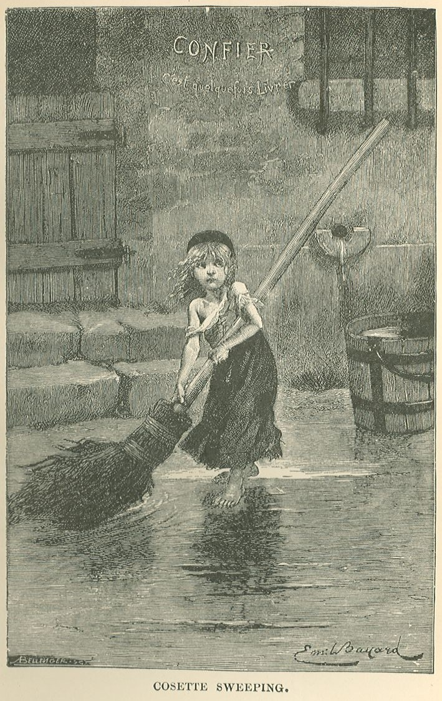
  <figcaption>Cosette from <em>Les Misérables</em></figcaption>
</figure>
]

.pull-right[
<figure>
  
  <figcaption>King Lear</figcaption>
</figure>
]

]

.pull-right[
<figure>
  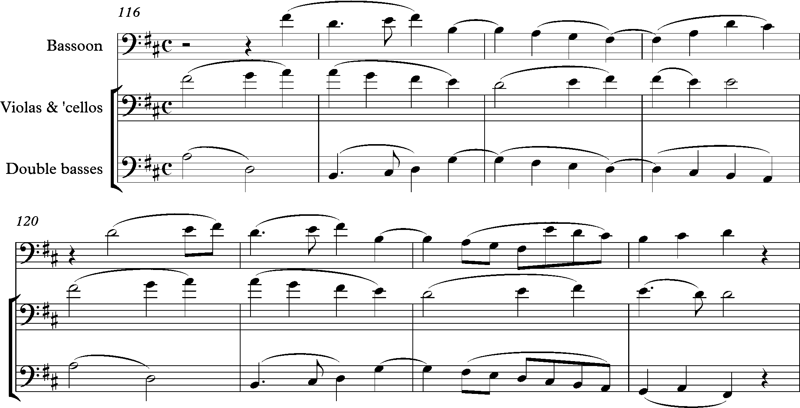
  <figcaption>Beethoven's 9th symphony</figcaption>
</figure>
]

???

Sources: 

- [Cosette](https://commons.wikimedia.org/wiki/File:Cosette-sweeping-les-miserables-albert-bellenger-1886.jpg)
- [King Lear](https://commons.wikimedia.org/wiki/File:King_Lear.jpg)
- [Beethoven](https://commons.wikimedia.org/wiki/File:Beethoven,_Symphony_No._9,_finale,_bars_116-123.png)

---

layout: false
class: middle

.box-2.huge[Facts ≠ truth]

---

class: middle

.box-2.large.sp-after[Where does truth come when<br>there are no facts?]

--

.box-inv-2.huge[Beauty]


---

layout: true
class: title title-2

---

# Beauty in science

.pull-left.center[

<figure>
  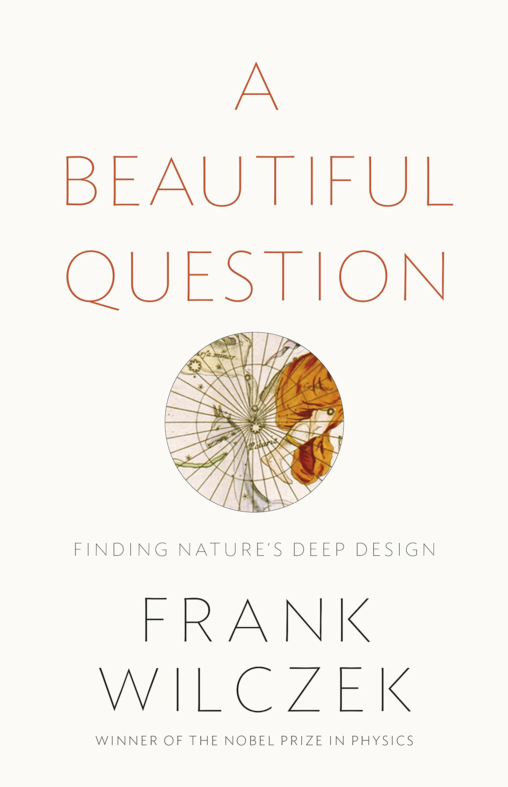
</figure>

]

.box-inv-2.medium[This is also true for science and math<br>and other more<br>factual realms]

---

# Rhetoric and beauty

.box-inv-2[λόγος&emsp;•&emsp;λέξις]

.box-inv-2.tiny.sp-after[Logos&emsp;•&emsp;Lexis]

.box-inv-2[Res&emsp;•&emsp;Verba]

.box-inv-2[Essence&emsp;•&emsp;Structure]

.box-inv-2.sp-after[Content&emsp;•&emsp;Form]

.box-2.medium[Truth&emsp;•&emsp;Beauty]

???

One is the underlying metaphysical meaning—what the author or artist intends. The other is *how* they convey that message—what it looks like, what they used, etc.

---

# Content + form

.box-inv-2.large[Art is how we translate core,<br>essential **content** (or truth!)<br>to different **forms**<br>for specific **audiences**.]

---

# Truth is beautiful

.box-inv-2.medium[Truth ≠ facts]

.box-inv-2.medium.sp-after[Truth comes from aesthetic<br>combination of content and form]

.box-2.medium[Facts require beauty to be true]

---

layout: false
name: data-beauty
class: center middle section-title section-title-3 animated fadeIn

# Data and beauty

---

layout: true
class: title title-3

---

# Just show me the data!

```{r load-datasaurus-dozen, echo=FALSE}
#dozen <- read_tsv("data/DatasaurusDozen.tsv")
#my_data <- dozen %>% 
#  filter(dataset == "dino") %>% 
#  select(x, y)
```

--

.pull-left-3.small-code[
```{r head-datasaurus}
#head(my_data, 10)
```
]

--

.pull-middle-3.small-code[
```{r summary-datasaurus, highlight.output=1}
#mean(my_data$x)
#mean(my_data$y)
#cor(my_data$x, my_data$y)
```
]

--

.pull-right-3[
&nbsp;

.box-inv-3[Seems reasonable]

&nbsp;

.box-inv-3[Seems reasonable]

&nbsp;

.box-inv-3[No correlation]
]

---

# oh no

.center[
<figure>
  
  <figcaption><a href="https://www.autodeskresearch.com/publications/samestats" target="_blank">The Datasaurus Dozen</a></figcaption>
</figure>
]

---

# Raw data is not enough

.box-inv-3.small[Each of these has the same mean, standard deviation, variance, and correlation]

```{r plot-full-dozen, echo=FALSE, fig.dim=c(10, 4), out.width="100%"}
#ggplot(filter(dozen, dataset != "bullseye"), aes(x = x, y = y)) +
#  geom_point(size = 1) +
#  facet_wrap(vars(dataset))
```


---

# Humans love patterns

.center[
<figure>
  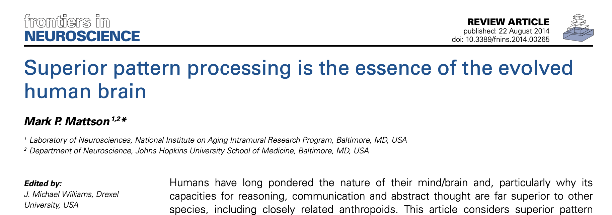
  <figcaption><a href="https://doi.org/10.3389/fnins.2014.00265" target="_blank">https://doi.org/10.3389/fnins.2014.00265</a></figcaption>
</figure>
]

---

# (Sometimes we love them too much)

--

.center[
.box-inv-3.sp-after[**Pareidolia**: seeing patterns that aren't there.]
]

--

.pull-left-3[

]

--

.pull-middle-3[

]

--

.pull-right-3[

]

---

# Beauty is necessary to see patterns

.pull-left[

<figure>
  
</figure>

]

--

.pull-right.center[

<figure>
  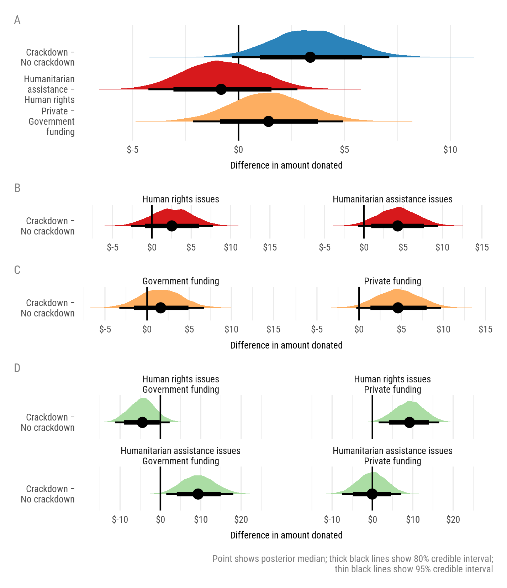
</figure>

]

---

layout: false
class: middle

.box-3.large[Beauty is necessary for truth]

---

layout: true
class: title title-3

---

# What makes a good visualization?

.box-inv-3.medium[No substantive issues]

--

.box-inv-3.medium[No perceptual issues]

--

.box-inv-3.medium[Honesty + good judgment]

--

.box-inv-3.medium[Good aesthetics]

.box-3.tiny[Kieran Healy, *Data Visualization: A Practical Introduction*]

---

# What's wrong?

.center[
<figure>
  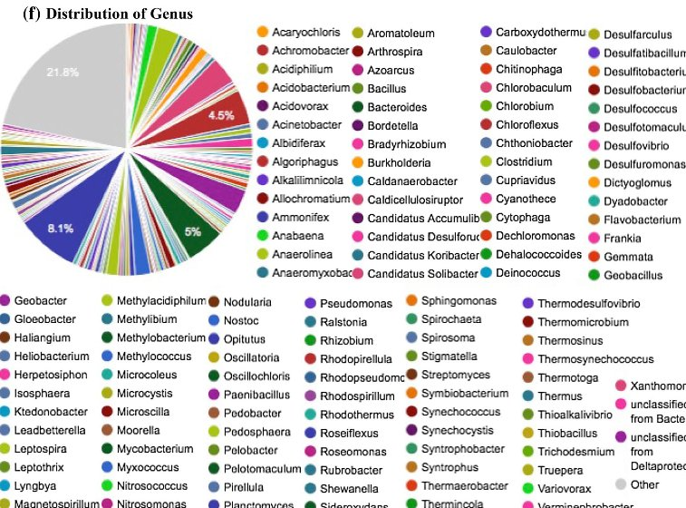
</figure>
]

???

- Aesthetic issues
- Substantive issues
- Perceptual issues
- Honesty + judgment issues

---

# What's wrong?

.center[
<figure>
  
</figure>
]

???

- Aesthetic issues
- Substantive issues
- Perceptual issues
- Honesty + judgment issues

---

# What's wrong?

.center[
<figure>
  
</figure>
]

???

- Aesthetic issues
- Substantive issues
- Perceptual issues
- Honesty + judgment issues

---

layout: false
name: beauty-crap
class: center middle section-title section-title-5 animated fadeIn

# Design and beauty

---

layout: true
class: title title-5

---

# Why even care about design?

.center[
<figure>
  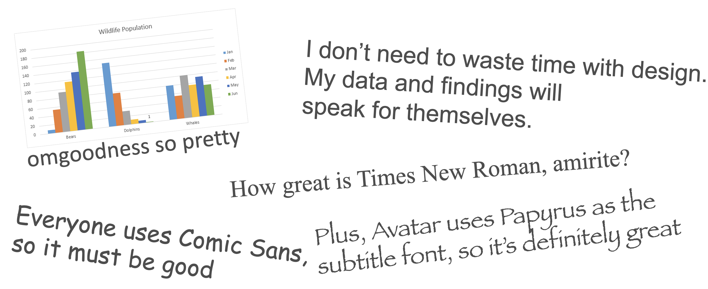
</figure>
]

---

# Beauty, stories, and truth

.box-inv-5[Truth comes from **aesthetic** combination of content and form.]

--

.box-inv-5[Raw facts must be communicated through some form.]

--

.box-inv-5.sp-after[**Beauty** shapes that form.]

--

.box-5.medium[There are aesthetic principles we can<br>follow to create beauty—and truth.]

---

# Principles of design

--

.box-inv-5.medium[There are thousands of books and<br>centuries of debate and theory about<br>what makes good design.]

--

.box-5.medium[The easiest<br>and most memorable distillation<br>of these principles is **CRAP**.]

---

# CRAP

.pull-left[

.box-5[Use these principles as a checklist when creating and critiquing designed objects:]

.box-1[Contrast]

.box-inv-4[Repetition]

.box-inv-1[Alignment]

.box-4[Proximity]

]

.pull-right.center[
<figure>
  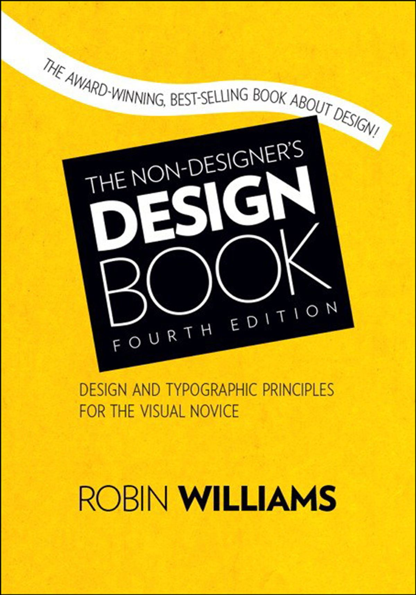
  <figcaption>Buy this book and your life will change forever.</figcaption>
</figure>
]

---

layout: true
class: title title-1

---

name: contrast

# Contrast

.box-inv-1.large[If two items are not exactly<br>the same, make them different.<br>Really different.]

--

.box-1.large[**Don't be a wimp.**]

---

# Typographic contrast: Family

.box-inv-1[Use contrasting type families]

.box-1.small[<span style="font-family: 'EB Garamond'">Serif</span> + <span style="font-family: 'Oswald'">Sans serif</span>&emsp;&emsp;<span style="font-family: 'Dancing Script'">Script</span> + <span style="font-family: 'EB Garamond'">Serif</span>&emsp;&emsp;<span style="font-family: 'Alfa Slab One'">Slab</span> + <span style="font-family: 'Oswald'">Sans serif</span>&emsp;&emsp;etc.]

<table>
  <tr>
    <td class="cell-left">Serif</td>
    <td class="cell-left" style="font-family: 'EB Garamond'">Sphinx of black quartz, judge my vow</td>
  </tr>
  <tr>
    <td class="cell-left">Sans serif</td>
    <td class="cell-left" style="font-family: 'Oswald'">Sphinx of black quartz, judge my vow</td>
  </tr>
  <tr>
    <td class="cell-left">Slab serif</td>
    <td class="cell-left" style="font-family: 'Alfa Slab One'">Sphinx of black quartz, judge my vow</td>
  </tr>
  <tr>
    <td class="cell-left">Script</td>
    <td class="cell-left" style="font-family: 'Dancing Script'">Sphinx of black quartz, judge my vow</td>
  </tr>
  <tr>
    <td class="cell-left">Monospaced&emsp;</td>
    <td class="cell-left" style="font-family: 'Inconsolata'">Sphinx of black quartz, judge my vow</td>
  </tr>
</table>

---

# Typographic constrast: Family

.box-inv-1[Add contrast in family]

.pull-left.frame[

<span style="font-size: 1em; font-family: 'EB Garamond';">Here’s a heading</span>

<span style="font-size: 0.9em; font-family: 'Times', serif;">Lorem ipsum dolor sit amet, consectetur adipisicing elit, sed do eiusmod tempor incididunt ut labore et dolore magna aliqua.</span>

]

--

.pull-right.frame[

<span style="font-size: 1.1em; font-family: 'Alfa Slab One'; font-weight: 600;">Here’s a heading</span>

<span style="font-size: 0.9em; font-family: 'Source Sans Pro'; font-weight: 300;">Lorem ipsum dolor sit amet, consectetur adipisicing elit, sed do eiusmod tempor incididunt ut labore et dolore magna aliqua.</span>

]

---

# Typographic contrast: Weight

.box-inv-1[Use contrasting weights in same type family]

.box-1.small[<span style="font-family: 'Source Sans Pro'; font-weight: 700;">Bold</span> + <span style="font-family: 'Source Sans Pro'; font-weight: 400;">Regular</span>&emsp;&emsp;<span style="font-family: 'Source Sans Pro'; font-weight: 400;">Regular</span> + <span style="font-family: 'Source Sans Pro'; font-weight: 200;">Extra light</span>&emsp;&emsp;<span style="font-family: 'Source Sans Pro'; font-weight: 900;">Black</span> + <span style="font-family: 'Source Sans Pro'; font-weight: 300;">Light</span>&emsp;&emsp;etc.]

<table>
  <tr>
    <td class="cell-left">Extra light&emsp;</td>
    <td class="cell-left" style="font-family: 'Source Sans Pro'; font-weight: 200;">Sphinx of black quartz, judge my vow</td>
  </tr>
  <tr>
    <td class="cell-left">Light</td>
    <td class="cell-left" style="font-family: 'Source Sans Pro'; font-weight: 300;">Sphinx of black quartz, judge my vow</td>
  </tr>
  <tr>
    <td class="cell-left">Regular</td>
    <td class="cell-left" style="font-family: 'Source Sans Pro'; font-weight: 400;">Sphinx of black quartz, judge my vow</td>
  </tr>
  <tr>
    <td class="cell-left">Semi bold</td>
    <td class="cell-left" style="font-family: 'Source Sans Pro'; font-weight: 600;">Sphinx of black quartz, judge my vow</td>
  </tr>
  <tr>
    <td class="cell-left">Bold&emsp;</td>
    <td class="cell-left" style="font-family: 'Source Sans Pro'; font-weight: 700;">Sphinx of black quartz, judge my vow</td>
  </tr>
  <tr>
    <td class="cell-left">Black</td>
    <td class="cell-left" style="font-family: 'Source Sans Pro'; font-weight: 900;">Sphinx of black quartz, judge my vow</td>
  </tr>
</table>

---

# Typographic constrast: Weight

.box-inv-1[Add contrast in weight]


.pull-left.frame[

<span style="font-size: 1em;">Here’s a heading</span>

<span style="font-size: 0.9em;">Lorem ipsum dolor sit amet, consectetur adipisicing elit, sed do eiusmod tempor incididunt ut labore et dolore magna aliqua.</span>

]

--

.pull-right.frame[

<span style="font-size: 1.3em; font-family: 'Source Sans Pro'; font-weight: 600;">Here’s a heading</span>

<span style="font-size: 0.9em; font-family: 'Source Sans Pro'; font-weight: 200;">Lorem ipsum dolor sit amet, consectetur adipisicing elit, sed do eiusmod tempor incididunt ut labore et dolore magna aliqua.</span>

]

---

# Color contrast

.box-inv-1[Color theory]

.box-1.tiny[[color.adobe.com](https://color.adobe.com)]

.pull-left[
<figure>
  
  <figcaption>Triad</figcaption>
</figure>

<figure>
  
  <figcaption>Monochromatic</figcaption>
</figure>
]

.pull-right[
<figure>
  
  <figcaption>Complementary</figcaption>
</figure>

<figure>
  
  <figcaption>Split complementary</figcaption>
</figure>
]

---

# Color contrast

.center[
<figure>
  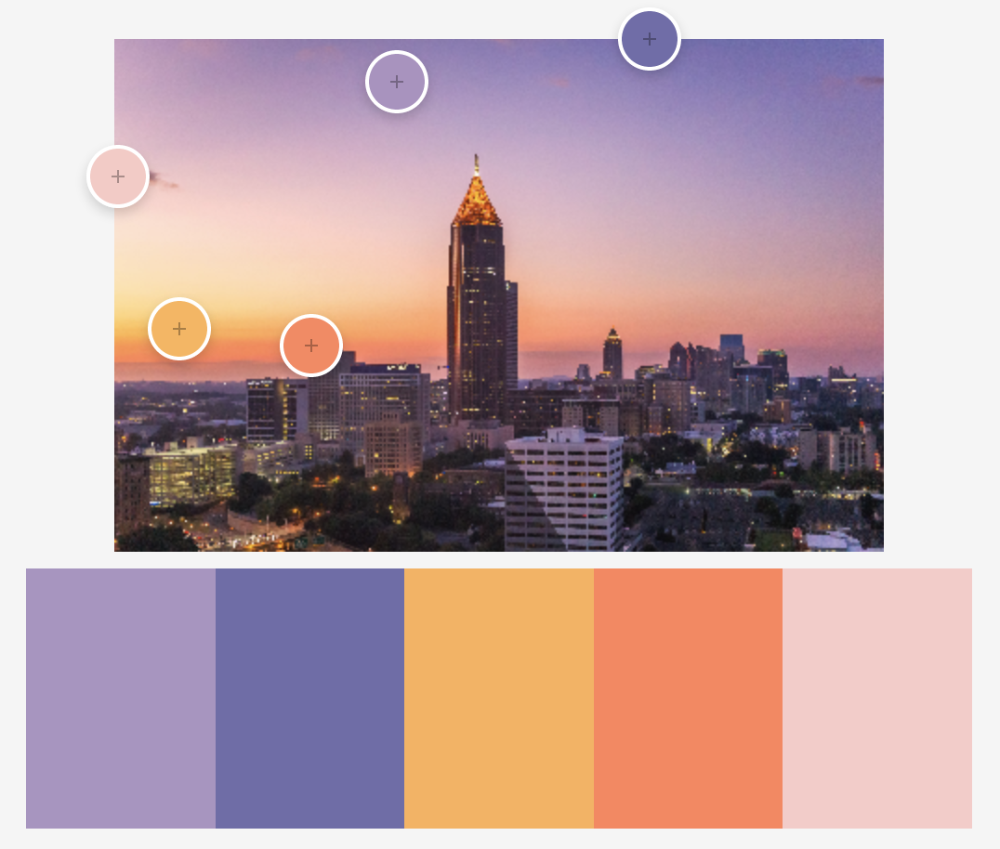
  <figcaption>Colors extracted from an image at <a href="https://color.adobe.com">color.adobe.com</a></figcaption>
</figure>
]

???

Photo by [Brad Huchteman](https://unsplash.com/photos/sR1Kz2auNJE) on Unsplash

---

# Usability and accessibility

.box-inv-1.medium[Perceptually uniform colors]

.box-1[Values close to each other use similar colors,<br>and values far from each other use different colors]

--

.box-inv-1.medium[Colorblind-safe colors]

.box-1[8% of men & 0.05% of women have some form of color blindness]

.box-1[Colors should be distinguishable by people<br>with common forms of color blindness]

---

# Perceptually uniform colors

.pull-left[
<figure>
  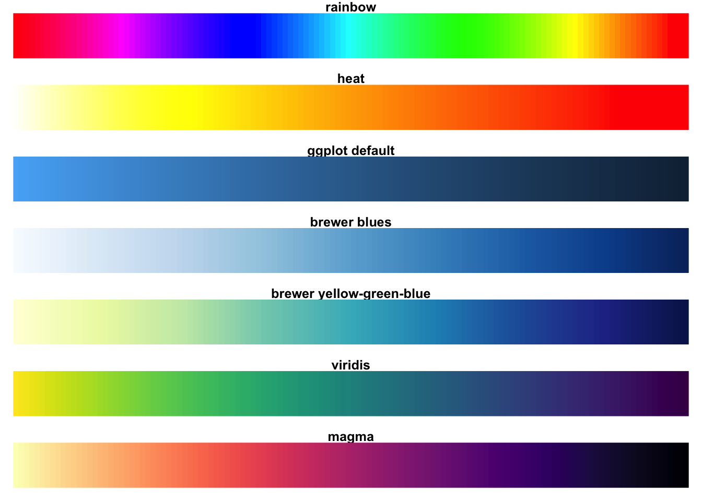
  <figcaption>Traditional palettes vs. viridis</figcaption>
</figure>
]

--

.pull-right[
<figure>
  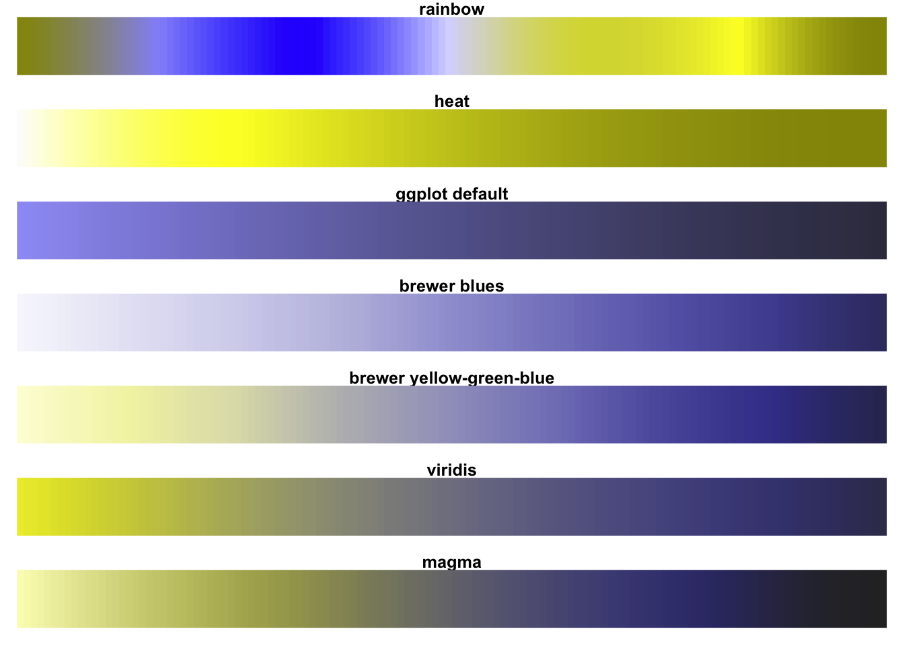
  <figcaption>Traditional palettes vs. viridis as seen with deuteranopia</figcaption>
</figure>
]

---

# Perceptually uniform colors

```{r echo=FALSE}
#counties_ga <-  counties_sf("longlat") %>% 
#  filter(iso_3166_2 == "GA")
```

.pull-left-3[
<figure>
```{r ga1, echo=FALSE, fig.width=5, fig.height=6}
#ggplot(counties_ga) +
#  geom_sf(aes(fill = census_area), size = 0.25, color = "white") + 
#  scale_fill_gradientn(colors = rainbow(5), guide = FALSE) +
#  theme_void()
```

<figcaption>Georgia counties filled by area, rainbow palette (NOT GOOD)</figcaption>
</figure>
]

--

.pull-middle-3[
<figure>
```{r ga2, echo=FALSE, fig.width=5, fig.height=6}
#ggplot(counties_ga) +
#  geom_sf(aes(fill = census_area), size = 0.25, color = "white") + 
#  scale_fill_viridis_c(guide = FALSE) +
#  theme_void()
```

<figcaption>Georgia counties filled by area, viridis::viridis palette</figcaption>
</figure>
]

--

.pull-right-3[
<figure>
```{r ga3, echo=FALSE, fig.width=5, fig.height=6}
#ggplot(counties_ga) +
#  geom_sf(aes(fill = census_area), size = 0.25, color = "white") + 
#  scale_fill_viridis_c(option = "inferno", guide = FALSE) +
#  theme_void()
```

<figcaption>Georgia counties filled by area, viridis::inferno palette</figcaption>
</figure>
]

---

layout: true
class: title title-inv-4

---

name: repetition

# Repetition

&nbsp;

.box-4.large[Repeat some aspect<br>of the design throughout<br>the entire piece.]

---

# Things to repeat

.box-4.medium[Colors]

--

.box-4.medium[Fonts]

.box-inv-4.sp-after[Families, weights, sizes]

--

.box-4.medium[Graphical elements]

--

.box-4.medium[Alignments]

---

layout: false
class: bg-full
background-image: url("img/oxfam-annual-report.jpg")

???

Source: Pages 5 and 9 from Oxfam's 2019 Annual Report/: https://assets.oxfamamerica.org/media/documents/2019_Oxfam_America_Annual_Report_web.pdf

If you want to see generally great examples of public sector designs, search for "<big charity or think tank name> annual report", like "red cross annual report" or "urban institute annual report"

---

layout: true
class: title title-inv-1

---

name: alignment

# Alignment

&nbsp;

.box-1.large[Every item should have a<br>visual connection with<br>something else on the page.]

---

# Alignment

.pull-left[
<figure>
  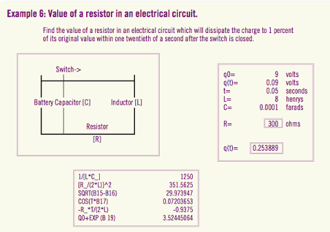
  <figcaption>Bad alignment</figcaption>
</figure>
]

--

.pull-right[
<figure>
  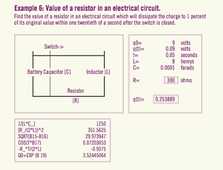
  <figcaption>Good alignment—everything is connected to something</figcaption>
</figure>
]

???

Source: Robin Williams, *The Non-Designer's Design Book*

---

# Alignment + repetition


.box-1[Share lines and repeat alignments where possible.]

.pull-left[
<figure>
  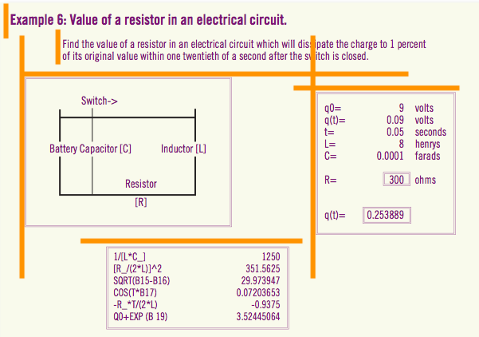
  <figcaption>4 vertical alignments; 3 horizontal alignments</figcaption>
</figure>
]

.pull-right[
<figure>
  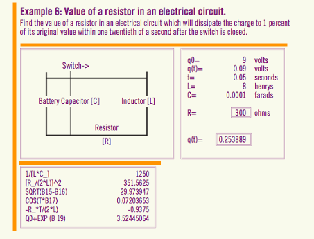
  <figcaption>1 shared vertical alignment; 2 horizontal alignments</figcaption>
</figure>
]

---

# Alignment + contrast

.box-1[Center + left is super common, but has weak contrast]

.box-inv-1[Mixing left and right alignment provides stronger contrast]

.pull-left.frame[

<p style="font-size: 0.7em; text-align: center; font-weight: bold;">Chapter 1</p>

<p style="font-size: 0.9em; text-align: center; margin-bottom: 1.5em;">Here’s a title</p>

<p style="font-size: 0.65em;">Lorem ipsum dolor sit amet, consectetur adipisicing elit, sed do eiusmod tempor incididunt ut labore et dolore magna aliqua.</p>

]

--

.pull-right.frame[

<p style="font-size: 0.7em; text-align: right; font-weight: bold;">Chapter 1</p>

<p style="font-size: 0.9em; text-align: right; margin-bottom: 1.5em">Here’s a title</p>

<p style="font-size: 0.65em; text-align: justify; hyphens: manual;">Lorem ipsum dolor sit amet, con&shy;sec&shy;tetur adi&shy;pis&shy;icing elit, sed do eiusmod tempor in&shy;ci&shy;di&shy;dunt ut labore et dolore magna aliqua.</p>

]

---

layout: true
class: title title-4

---

name: proximity

# Proximity

&nbsp;

.box-inv-4.large[Group related items together.]

---

# Proximity

.box-inv-4[Use white space, color, location, contrast, repetition,<br>alignment, etc. to make visually distinct groupings]

--

.pull-left[
<figure>
  
  <figcaption>Bad proximity; no logical groupings</figcaption>
</figure>
]

--

.pull-right[
<figure>
  
  <figcaption>Good proximity; information visually grouped</figcaption>
</figure>
]

???

Source: Robin Williams, *The Non-Designer's Design Book*

---

layout: true
class: title title-5

---

# CRAP review

.pull-left[
.pull-left[

.box-1[Contrast]

<figure>
  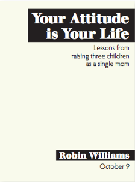
</figure>
]

.pull-right[

.box-inv-4[Repetition]

<figure>
  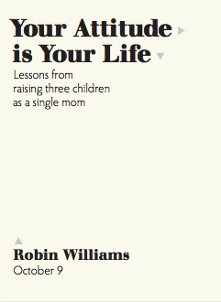
</figure>
]
]

.pull-right[
.pull-left[

.box-inv-1[Alignment]

<figure>
  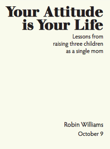
</figure>
]

.pull-right[

.box-4[Proximity]

<figure>
  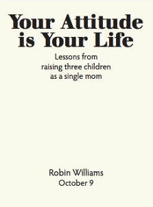
</figure>
]
]

---

# CRAP in action

.center[
```{r ggplot-before, echo=FALSE, fig.width=8, fig.asp=0.618, out.width="75%"}
#library(gapminder)
#library(scales)

#gapminder_filtered <- gapminder %>% 
#  filter(year > 2000)

#ggplot(data = gapminder_filtered,
#       mapping = aes(x = gdpPercap, y = lifeExp, 
#                     color = continent, size = pop)) +
#  geom_point() +
#  scale_x_log10() +
#  labs(x = "GDP per capita", y = "Life expectancy",
#       color = "Continent", size = "Population",
#       title = "Here's a cool title",
#       subtitle = "And here's a neat subtitle",
#       caption = "Source: The Gapminder Project") +
#  facet_wrap(vars(year))
```
]

---

# CRAP in action


---

layout: false
name: moral-story
class: center middle section-title section-title-7 animated fadeIn

# Moral of the story

---

layout: true
class: title title-7

---

# Moral of the story

.box-inv-7.medium.sp-after[Facts require beauty to be true]

--

.box-inv-7.medium.sp-after[You can (and should) develop these skills!]

--

.box-inv-7.medium[*Care* about design.]

---

layout: false
class: middle

.box-7.medium[andhs.co/umontreal-dataviz]


```{r echo=FALSE, include=FALSE, eval=FALSE}
pagedown::chrome_print("slides.html", 
                       output = "andrew-heiss_umontreal-dataviz_2019-09-17.pdf")
```
